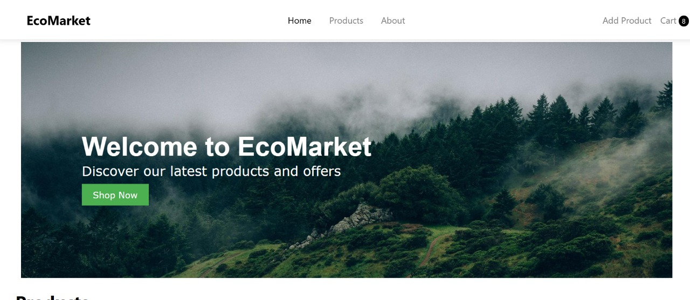
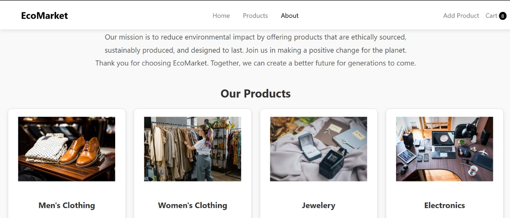

# EcoMarket - E-commerce Website

EcoMarket Screenshot <!----> 
                    <!---->

EcoMarket is a modern, single-page e-commerce website built using Vite, React, Tailwind CSS, and JSON Server. It allows users to browse products, add them to a cart, and view product details. The cart data persists even after page reloads using localStorage.

# Table of Contents

Features

Technologies Used

Setup Instruction

Project Structure

Contributing

License

# Features

Home Page: Displays featured products and a hero section.

Product Listing Page: Shows all products with filtering by category.

Product Details Page: Displays detailed information about a product.

Add Product Page: Allows admins to add new products to the store.

Cart Page: Displays items in the cart, allows updating quantities, and calculates the total price.

Persistent Cart: Cart data is saved in localStorage and persists after page reloads.

Responsive Design: The website is fully responsive and works on all devices.

# Technologies Used

* Frontend:

React

Vite

 CSS

React Router

* Backend:

JSON Server (for mock API)

* Version Control:

Git and GitHub

* Deployment:

Vercel

# Setup Instructions

Prerequisites
Node.js (v16 or higher)

npm (v8 or higher)

# Steps to Run the Project

* Clone the Repository:

git clone https://github.com/your-username/EcoMarket-Website.git

cd EcoMarket-Website

* Install Dependencies:

npm install

* Start the JSON Server:

Run the JSON Server to mock the backend:

npm run server

The server will run at http://localhost:3000.

* Start the Development Server:

In a new terminal, start the Vite development server:

npm run dev

The website will be available at http://localhost:5173.

* Build for Production:

* To create a production build:

npm run build

* Deploy:

Deploy the project using Vercel, Netlify, or GitHub Pages.

# Project Structure

EcoMarket-Website/
├── public/                  # Static assets
├── src/
│   ├── components/          # React components
│   │   ├── NavBar.jsx       # Navigation bar
│   │   ├── Home.jsx         # Home page
│   │   ├── Products.jsx     # Product listing page
│   │   ├── ProductCard.jsx  # Product card component
│   │   ├── ProductDetails.jsx # Product details page
│   │   ├── AddProduct.jsx   # Add product page
│   │   ├── Cart.jsx         # Cart page
│   │   └── About.jsx        # About page
│   ├── styles/              # CSS files
│   ├── App.jsx              # Main application component
│   └── main.jsx             # Entry point
├── db.json                  # JSON Server database
├── package.json             # Project dependencies
├── README.md                # Project documentation
└── vite.config.js           # Vite configuration

# Contributing

We welcome contributions! If you'd like to contribute to this project, follow these steps:

Fork the repository.

* Create a new branch for your feature:

git checkout -b feature/your-feature-name

* Commit your changes:

git commit -m "Add your feature"

* Push to the branch:

git push origin feature/your-feature-name

Open a pull request.

# License

This project is licensed under the MIT License. See the LICENSE file for details.

# Acknowledgments

Special thanks to our team for their hard work and collaboration.

Inspired by modern e-commerce websites like Amazon and Flipkart.